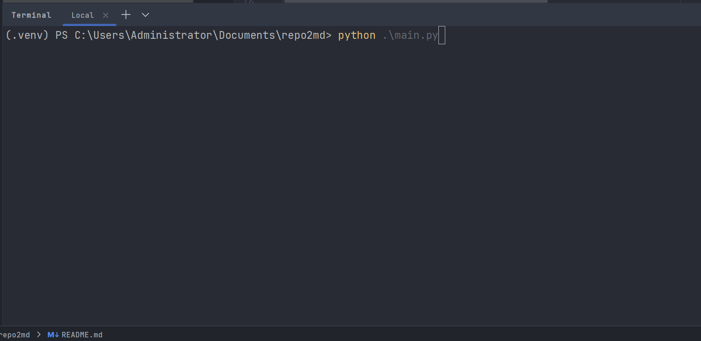

# Repo2Md

将 Github / Gitee 等仓库的代码转换成 Markdown 格式，方便智能体学习！

## ✨ 效果展示



## 🚀 快速开始

### 直接使用

1. 到 [Release](https://github.com/zhiyu1998/repo2md/releases) 下载最新版本

2. linux 赋予权限

```shell
chmod 755 myapp-linux && mv myapp-linux repo2md
```

2. 开始使用

```shell
./repo2md
```

### 手动构建

1. Git下载

```shell
git clone https://github.com/zhiyu1998/repo2md.git
```

2. 安装依赖

```shell
pip install -r requirements.txt
```

3. 运行

```shell
python main.py
```

